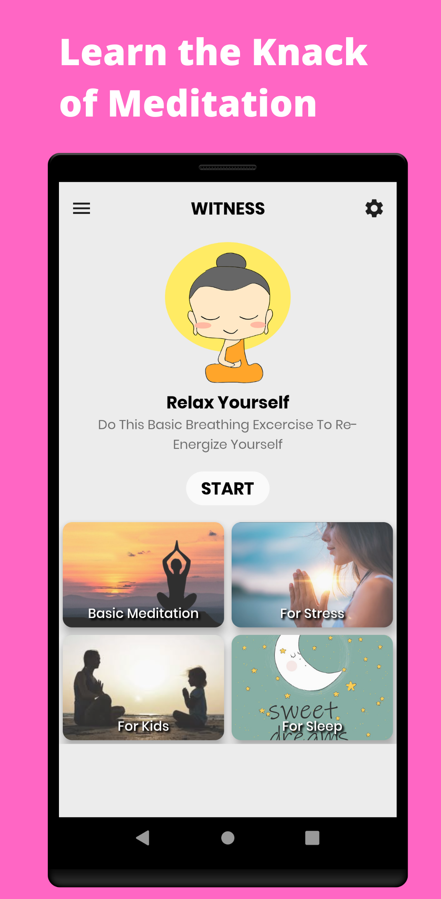
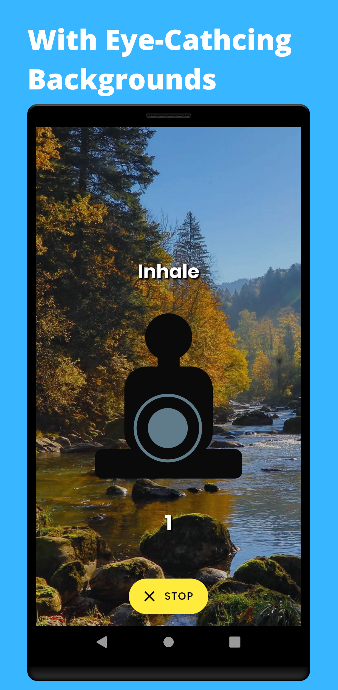
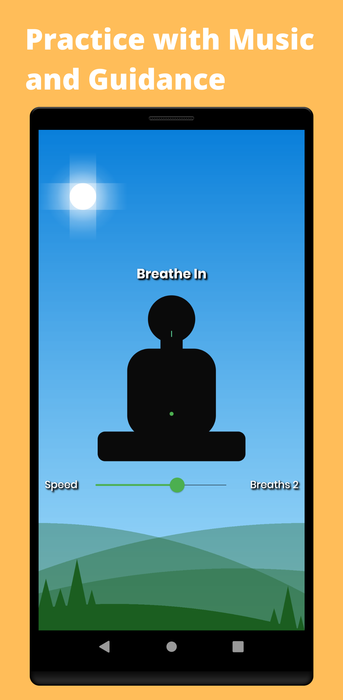
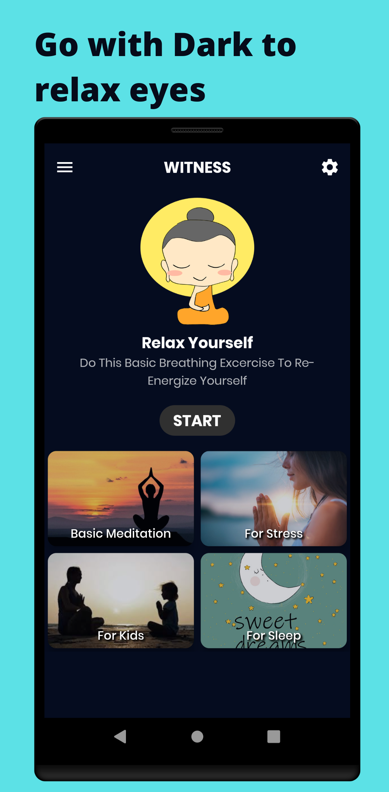
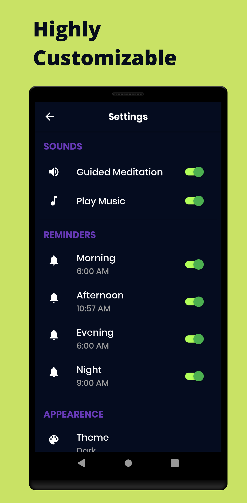

# Aware: Breathe Focused Meditation App
Breathing plays a very important role in our life. Not only it keeps you alive but control and depth of breathing define your personality also. Like if you are a deep breather it helps you to get rid of anxiety and depression.
Few breaths before facing an interview or public speaking make you calm and make your voice much clear.
I have gone through many apps but none of them was not what I was looking for. Most of those were hiding the main feature behind the paywall which was not affordable.
Being a developer, Instead of paying for features, I decided to develop an app on weekend and successfully launched it on Google Play.
I want you all to go through it and review it. If you have any kind of suggestion You are welcome to just email me on
er.sanjeevbishnoi@gmail.com

Download it from the link below

_Google Play and the Google Play logo are trademarks of Google LLC._

## Screenshots
  

  
  
  
  
  
  

